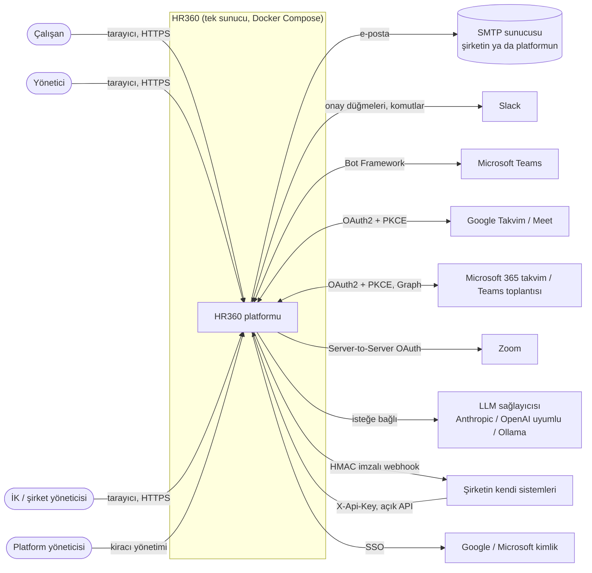
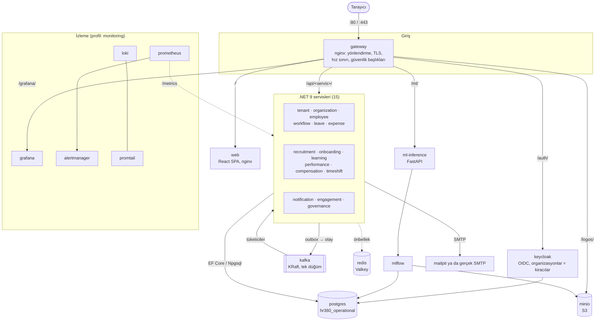
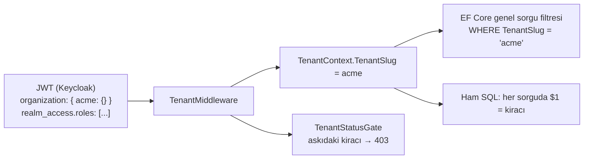
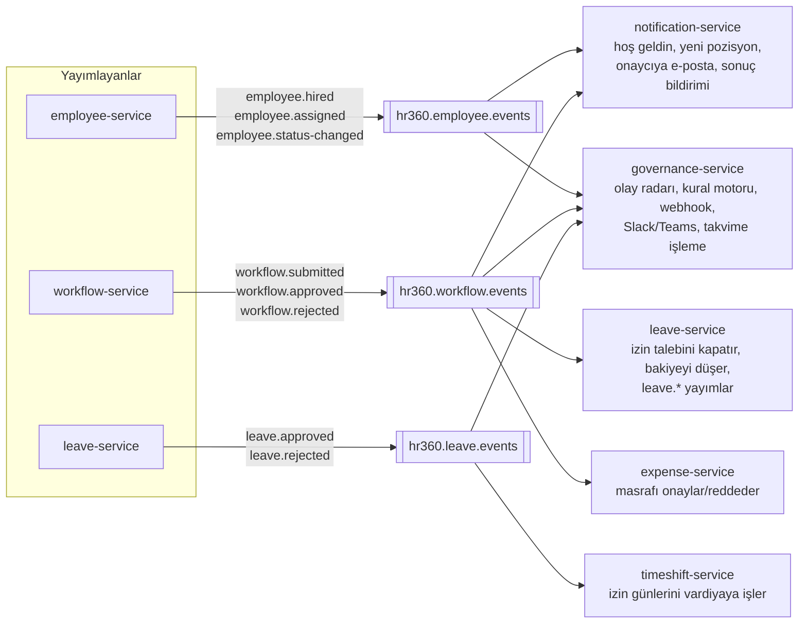
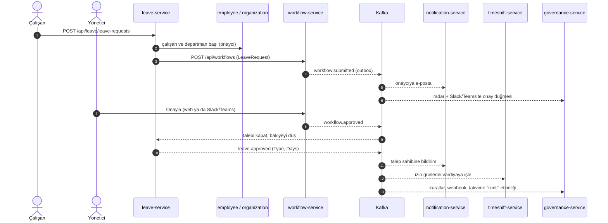
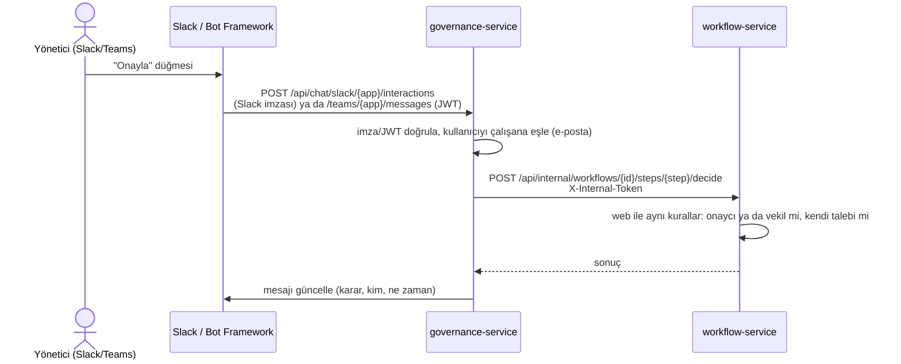

# HR360 mimarisi

Bu belge sistemin bütününü dört düzeyde anlatır:

1. Bağlam: HR360 kimlerle ve hangi dış sistemlerle konuşur.
2. Konteynerler: hangi servisler var ve aralarında hangi yollar açık.
3. Olay akışı: Kafka'daki olayları kim yayımlar, kim tüketir.
4. Önemli akışlar: izin onayı, Slack'ten onay, işe alım.

Servis bazında uç listesi [modules-README](../architecture/modules-README.md) dosyasında,
canlı API belgesi uygulamada **Yönetim → API belgeleri** ekranındadır (`/panel/api-belgeleri`).

Diyagramlar Mermaid ile yazıldı; GitHub ve çoğu Markdown görüntüleyici doğrudan çizer.

---

## 1. Sistem bağlamı (C4 düzey 1)

Dış sistemlerin hepsi isteğe bağlıdır: hiçbiri tanımlanmadan HR360 tam çalışır.
Tanımlandıklarında kimlik bilgileri kiracı bazında şifreli saklanır (AES-256-GCM).

## 2. Konteynerler (C4 düzey 2)

| Konteyner | Görev | Dışarı açık mı |
|---|---|---|
| gateway | Tek giriş noktası. `/api/<servis>/X` → servisin `/api/X` ucu | 80, 443 (HTTPS açıksa), 8090 (Keycloak paneli "ayrı port" modunda) |
| web | Derlenmiş React uygulaması, katı CSP | gateway üzerinden |
| keycloak | Giriş, roller, kiracı = Keycloak organizasyonu | gateway üzerinden (`/auth/`); 8080 yalnızca 127.0.0.1 |
| 15 .NET servisi | İş mantığı (aşağıda) | hayır |
| postgres | Tek veritabanı sunucusu: `hr360_operational`, `keycloak`, `hr360_mlflow` | yalnızca 127.0.0.1:5432 |
| kafka | Servisler arası olaylar | hayır |
| redis (Valkey) | Kısa ömürlü önbellek, hız sınırı sayacı | hayır |
| minio | Logolar, ML artefaktları | konsol yalnızca 127.0.0.1:9001 |
| ml-inference, mlflow | Ayrılma riski modeli, AI araçları (CV ayrıştırma, ilan dili denetimi), model kaydı | ml-inference gateway üzerinden; mlflow yalnızca 127.0.0.1 |
| prometheus, alertmanager, grafana, loki, promtail, exporter'lar | İzleme, alarm, log | grafana gateway üzerinden |
| certbot | Let's Encrypt yenileme (profil: letsencrypt) | hayır |

### Servisler

| Servis | Sahip olduğu veri (tablo öneki) | Notlar |
|---|---|---|
| tenant | `platform_tenants` | Kiracı kaydı, Keycloak organizasyon/kullanıcı yönetimi, marka, kiracının SMTP'si |
| organization | `organization_*` | Şirket, departman, ekip |
| employee | `employee_*` | Çalışan ana verisi, atamalar |
| workflow | `workflow_*` | Çok adımlı onay, vekâlet, SLA |
| leave | `leave_*` | Bakiye, talep, resmi tatil |
| expense | `expense_*` | Masraf, özlük belgesi, İK vakası |
| recruitment | `recruitment_*` | İlan, aday, başvuru, mülakat |
| onboarding | `onboarding_*` | İşe başlangıç planı, zimmet |
| learning | `learning_*` | Eğitim, kayıt, sertifika |
| performance | `performance_*` | Dönem, hedef, değerlendirme, analiz |
| compensation | `compensation_*` | Ücret geçmişi, bant |
| timeshift | `timeshift_*` | Vardiya, puantaj |
| notification | `notification_*` | Bildirim kuyruğu, e-posta gönderimi |
| engagement | `engagement_*` | Takdir, anket, 1:1, mentorluk, masa/ofis, ayrılış, yedekleme |
| governance | `governance_*` | Denetim, olay radarı, kural motoru, webhook, açık API, Slack/Teams, takvim/toplantı, AI, KVKK, analitik |

Tüm servisler aynı PostgreSQL veritabanını kullanır; her servis yalnızca kendi
öneki olan tablolara yazar. İki istisna bilinçlidir:

- **engagement** ve **governance** raporlama ve çapraz modül ekranları için diğer
  modüllerin tablolarını salt okunur sorgular (ör. ekip sağlığı izin, mesai, performans
  ve 1:1 verisini tek sorguda birleştirir). Yazma her zaman sahibi servisin API'siyle
  yapılır. İstisnalar: uygulama içi bildirim satırı (`notification_messages`) ve
  KVKK saklama politikalarının anonimleştirme/silme işleri.
- Ortak tablolar: `messaging_outbox`, `messaging_processed_events`, `audit_log` ve
  analitik görünümler (`analytics_*`).

### Çok kiracılılık

- Kiracı yalnızca jetondaki `organization` talebinden okunur; istek gövdesi ya da
  başlıkla değiştirilemez.
- Platform yöneticisi filtreyi atlar; kiracı değiştirirken arayüz Keycloak'tan
  `organization:<kiracı>` kapsamıyla yeni jeton alır.
- Önbellek anahtarları da kiracıyı içerir (`hr360:<önbellek>:<kiracı>:...`).

### Yetki

Keycloak realm rolleri: `employee`, `manager`, `accounting`, `hr-admin`,
`tenant-admin`, `platform-admin`. Ek izinler `ext-<izin>` rolleriyle verilir
(ör. `ext-leave-manageBalance`, `ext-recruitment-publish`). Kiracı yöneticisi bunları
Ekip ekranından atar. Servisler politikaları (`RequireHrAdmin`,
`RequireManagerOrAbove` vb.) kendileri uygular. Arayüzdeki izin denetimi yalnızca
neyin gösterileceğini belirler.

## 3. Olay akışı (Kafka)

Yayımlayan servis olayı iş kaydıyla **aynı veritabanı işleminde** `messaging_outbox`
tablosuna yazar (Outbox). Arka plan yayımcısı her 5 sn'de yayımlanmamış satırları
`FOR UPDATE SKIP LOCKED` ile alıp Kafka'ya gönderir:

- `acks=all`, idempotent üretici.
- Başlıklar: `event-type`, `event-id`.

Tablo ortaktır: hangi servisin yayımcısı alırsa alsın satır kendi konusuna gider.
Kilitleme sayesinde bir satır iki kez gönderilmez.

Tüketen servis olay kimliğini iş değişikliğiyle aynı işlemde
`messaging_processed_events` tablosuna yazar (Inbox). Aynı olay ikinci kez gelirse
atlanır. Hata durumunda en çok 5 kez artan beklemeyle yeniden denenir.

### Olay kataloğu

| Konu | Olay | Ne zaman | Yük (alanlar) |
|---|---|---|---|
| `hr360.employee.events` | `employee.hired` | Çalışan oluşturulunca | TenantSlug, EmployeeId, FirstName, LastName, Email, HireDate |
| | `employee.assigned` | Yeni atama (departman/pozisyon) | TenantSlug, EmployeeId, AssignmentId, DepartmentId, PositionTitle, EffectiveFrom, Email, FirstName, LastName |
| | `employee.status-changed` | Durum değişince (ör. ayrılış) | TenantSlug, EmployeeId, FirstName, LastName, OldStatus, NewStatus, EffectiveDate |
| `hr360.workflow.events` | `workflow.submitted` | Talep oluşunca ve her yeni onay adımında | TenantSlug, WorkflowRequestId, WorkflowType, RequesterEmployeeId, RequesterName, Subject, ApproverEmployeeId, ApproverEmail, ApproverFirstName, SlaDueAt |
| | `workflow.approved` / `workflow.rejected` | Akış sonuçlanınca | TenantSlug, WorkflowRequestId, WorkflowType, RequesterEmployeeId, Subject, Approved, DecidedByEmployeeId, Comment |
| `hr360.leave.events` | `leave.approved` / `leave.rejected` | İzin onay akışıyla ya da elle sonuçlanınca | TenantSlug, LeaveRequestId, EmployeeId, StartDate, EndDate, Approved, Type, Days |

Tüm yüklerde `OccurredAt` de vardır. `WorkflowType`: `LeaveRequest`, `ExpenseClaim`,
`PositionChange`, `AssetRequest`, `Other`. Alan adları PascalCase'tir.

| Tüketici (grup) | Konular | Yaptığı |
|---|---|---|
| leave-service | workflow | `LeaveRequest` türündeki kararlar: talebi kapatır, bakiyeyi (bekleyen → kullanılan) günceller, `leave.*` yayımlar |
| expense-service | workflow | `ExpenseClaim` türündeki kararlar: masrafı onaylar ya da reddeder |
| timeshift-service | leave | `leave.approved`: her gün için sistem yönetimli izin kaydı |
| notification-service | employee, workflow | Hoş geldin ve pozisyon e-postaları, onaycıya e-posta, talep sahibine uygulama içi sonuç |
| governance-service | `^hr360\..*` (hepsi) | `governance_events`'e yazar (30 gün), canlı olay radarına (SSE) iter, kural motoru, webhook'lar, Slack/Teams kanal bildirimleri, onaycıya Slack/Teams'te düğmeli mesaj, `leave.approved` için bağlı takvime "izinli" etkinliği |

Konular kurulumda `kafka-init` konteyneriyle oluşturulur. Yeni bir konu eklenirse
`docker-compose.yml`'deki bu listeye de eklenmelidir; böylece tüketiciler ilk olaydan
önce de konuya abone olabilir.

## 4. Önemli akışlar

### İzin talebi ve onayı

### Slack ya da Teams'ten onay

İç uç gateway'den erişilemez (`/api/*/internal/` → 404). Anahtar yalnızca workflow ve
governance servislerindedir.

### İşe alım: tekliften çalışana

governance-service, kabul edilen teklif için önce employee-service'te çalışanı
(`POST /api/employees`), sonra onboarding-service'te işe başlangıç planını
(`POST /api/onboarding-plans`) oluşturur. Çalışanın oluşması `employee.hired` olayını
tetikler; notification-service hoş geldin e-postasını gönderir.

## 5. Eşzamanlı servis çağrıları

| Çağıran → çağrılan | Amaç |
|---|---|
| leave, expense → employee, organization, workflow | Onaycıyı bul, onay akışını başlat/iptal et |
| workflow, timeshift, performance, learning, onboarding, notification, tenant → employee | Çalışan bilgisi (`/employees/me`, `/{id}`) |
| employee → organization | Departmandan ayrılan departman başını temizle |
| tenant → Keycloak yönetim API'si | Organizasyon, kullanıcı, rol, kimlik sağlayıcı |
| notification → tenant | Kiracının markası ve SMTP ayarı (iç uç) |
| engagement → employee | Ayrılış tamamlanınca çalışanı "Terminated" yap |
| governance → employee, onboarding | İşe alım sagası |
| governance → workflow (iç uç) | Slack/Teams kararları |
| governance, performance → ml-inference | İlan dili denetimi; performans anomali/eğilim analizi |

Çağrıların çoğu kullanıcının jetonunu aynen iletir; yetki her serviste yeniden
denetlenir. İstisnalar:

- workflow iç ucu `X-Internal-Token` kullanır.
- ml-inference performans uçları jeton istemez; yalnızca iç ağdan erişilebilir.
- tenant'ın SMTP iç ucu gateway'den erişilemez.

## 6. Kesişen konular

| Konu | Nasıl | Ayrıntı |
|---|---|---|
| Gözlemlenebilirlik | Her servis `/metrics` (prometheus-net), `X-Correlation-Id` gateway'den servislere, loglar Loki'de | [README → İzleme](../../README.md) |
| Alarm | Prometheus kuralları → Alertmanager → e-posta, Slack, Teams | `deploy/monitoring/` |
| Önbellek | Valkey; dizin, ofis doluluğu, ekip sağlığı, analitik; Redis yoksa doğrudan veritabanı | [yük testi](../performans/yuk-testi.md) |
| Güvenlik | Hız sınırı, CSP, root olmayan konteynerler, şifreli kiracı sırları, taramalar | [güvenlik](../guvenlik/README.md) |
| Yedek | `pg_dump` (3 veritabanı) + MinIO, tek arşiv | `scripts/backup.sh`, `scripts/restore.sh` |
| Test | Birim (.NET, Vitest, pytest), API entegrasyon (sahte sağlayıcılar), Playwright (4 rol × tüm ekranlar), k6 | [tests/README.md](../../tests/README.md) |

## 7. Bilinen sınırlar

- **Tek düğüm:** Kafka (1 bölüm, çoğaltma 1), PostgreSQL ve Keycloak tek kopyadır.
  2 vCPU'da yaklaşık 400 eşzamanlı kullanıcı test edildi. Daha fazlası için servisleri
  çoğaltmak ve gateway'de yük dengelemek gerekir. Önbellek ve açık API hız sayacı
  zaten paylaşımlıdır; gateway'in hız sınırı ise örnek başınadır.
- **Ortak veritabanı:** Servisler fiziksel olarak ayrı veritabanında değil. Raporlama
  için okuma kolaylığı sağlar, ama şema değişikliklerinde engagement ve governance'ın
  okuduğu tablolar da hesaba katılmalıdır.
- **Olay sözleşmesi:** Yükler C# kayıtlarından üretilir, şema kaydı yoktur. Alan
  ekleme geriye uyumludur; alan silme ya da yeniden adlandırma tüm tüketicileri etkiler.
